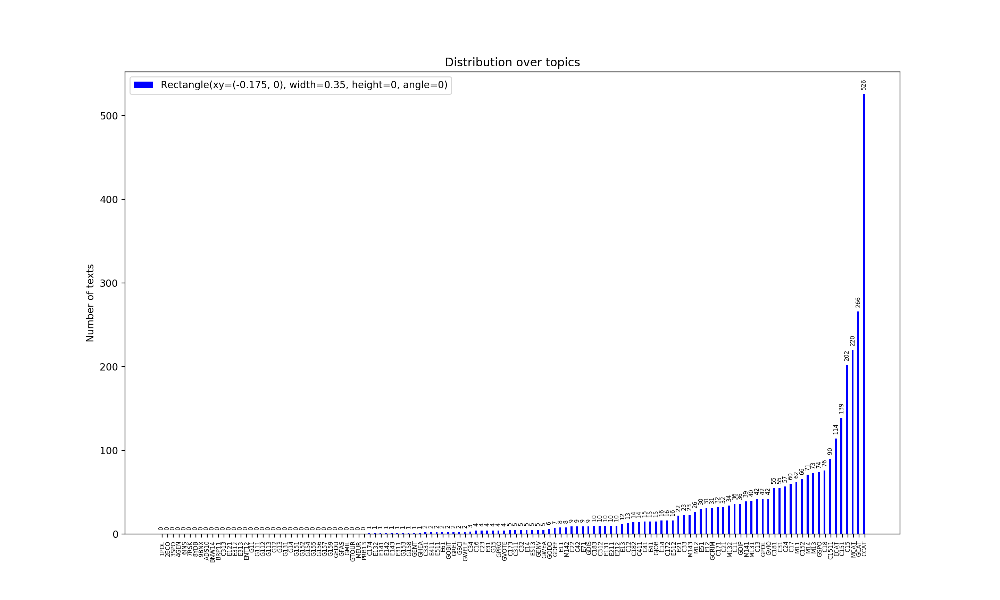
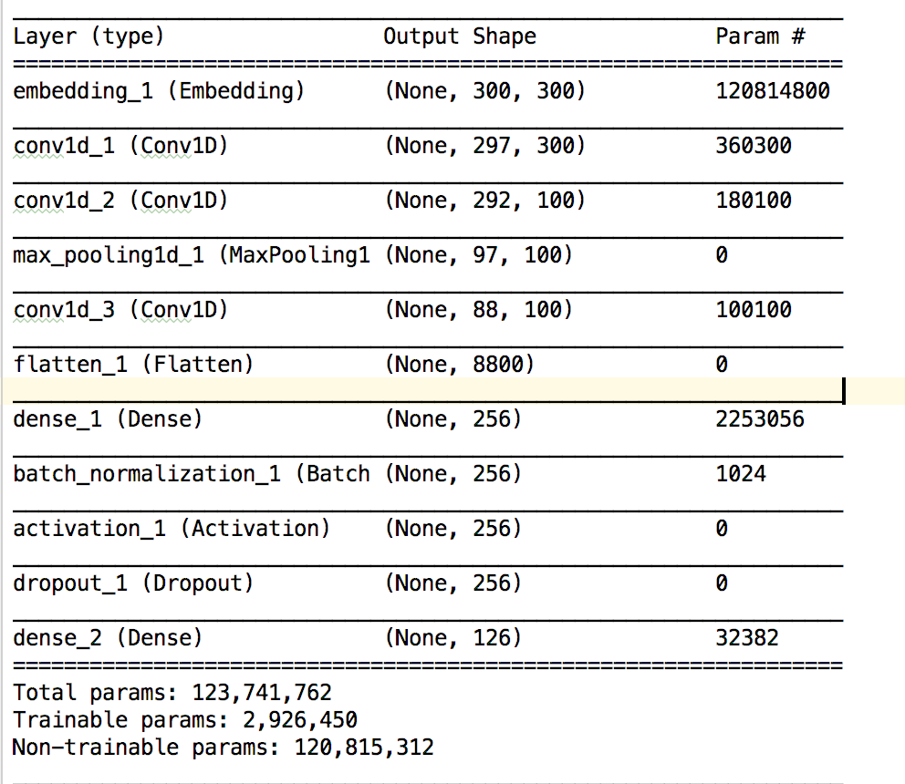

# Deep learning course project

This repo contains a deep learning course final project of team **supermoniveto**:
- Ville Tanskanen
- Ville Hyvönen
- Anisia Katinskaia

### Summary

The data we chose for our group was the [text data](https://keras.io/datasets/#reuters-newswire-topics-classification).
In the fashion of the course we used deep learning to learn the problem and do predictions.
We tried vast range of different models ranging from bag of words multilayer perceptron (MLP) to a combination of
different advanced techniques such as CNN and LSTM.

We looked at the distribution of tags in the released data and found out that some of the topic are mostly presented
 while others are never appear. Those rare tags would be difficult to learn to predict. :

First, we preprocessed the data, i.e. parsed xml-files, tokenized all texts, removed stop-words and punctuation,
lowercased all words and replaced numbers with NUM tag (maybe it was not a good idea because Glove has embeddings
for numbers, it might be useful to try without such replacement).

For the word embeddings we used the pre-trained [GloVe Embeddings](https://nlp.stanford.edu/projects/glove/).
Most of the modelling is done with 200 dimensional representations and the competition model training was done with
300 dimensional representations. For words which are not presented in Glove embedding set we initialised vectors
of random numbers from normal dictribution.

Some verification of the model was done with 20K random sample from the data, a bunch of experiments with CNN and
several experiments with LSTM were performed on the whole data. Experiments with combination of CNN and LSTM were done on
20K sample from the data.
10% of the data was used for validation and another 10% for testing. Cross-validation on the whole data was very time
consuming as well as training LSTM models.

During the testing we quickly realized that CNN was showing much better f score than any other models. As it seemed that
the CNN was the way to go we experimented a lot of differentsets of hyperparameters by hand (batch size, number of epochs,
dimensionality of embeddigns, with/without random initialisation for words not presented in Glove embedding set, number of
convolutional layers, number and sizes of filters, size of dropout, with/without batch normalization, pool size, size and
number of dense layers). After exhaustive search for the best hyperparameters we had some idea of what would be
our chosen model for the competition. Most of the experiments with hyperparameters and their results (f scores) are
saved in comments in text_processing.py module. Our best model has the following configuration:

 Being curious, we also expanded our views outside of the course and did some trials
  with combination of CNN and LSTM where first comes the convolutions and then the LSTM is applied for the convolved layers.
  Final two models that we tried were bidirectional LSTM, which is used for the sequence classification when the whole sequence
  is known, and gated recurrent unit (GRU) which should be similar to LSTM but have faster training as it is missing some
  of the gates from LSTM.

### Future work

During the project we discussed a lot and unfortunately some of the ideas were left out because of lack of time. There were bad ideas, decent ideas and great ideas. Some of the good ideas are presented below.
On the preprocessing side we could have done some word n-gram modelling. That is, to concatenate some combination of n words that often occur together and have a different meaning when they are presented together rather than separately. Such words could be mapped to one index of dictionary instead of mapping them to separate words. Such words could be ice hockey for 2-gram, golden state warriors for 3-gram and so on. It would probably be enough to look at the 2-grams and 3-grams only as they would capture most of the structure in everyday language.
Reading the notes from Moodle about the hierarchy of the tags, we also discussed that in order to capture the best result in the tags we should follow the tree structure also in modelling. One approach could be that we first predict which one of the "main" topics does an article belong, and then recursively go deeper with the predictions taking into account the results achieved higher in the hirerchy of tags.
Because there is hierarchy, we could also do some rule based verification after our current model. That is we could adjust our predictions by the tree structure. For example if we predict a tag that is in the same branch of the tag tree but we are not predicting its parents, we should probably also predict the parent, or adjust the prediction so that we do not predict the child. These could be handled whichever way, but the most important thing would avoid contradictions in the tree structure.
